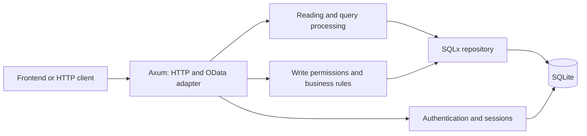

# RsvRoom backend project description

This document describes the current implementation in the separate Rust project. It is based on that project's source code, SQL migration, container configuration, and integration tests. This repository contains a copy of its documentation, not its source files.

## Purpose

RsvRoom is a server application for booking corporate resources: meeting rooms, workplaces, and parking spaces. It stores offices, users, and teams; checks resource availability and permissions; and manages bookings and individual work plans. The model also allows lockers, cars, and other resources.

The backend is a standalone Rust application. It requires its executable and a SQLite database; it does not use Node.js or SAP CAP at runtime. Entity names, JSON fields, and demo-data identifiers are retained from the original CAP project. Documents under `_CAP/` describe that project and serve as reference material.

The backend does not include a user interface. The root URL `/` returns JSON with service details and API endpoints.

## Technologies

| Component | Purpose |
| --- | --- |
| Rust, edition 2024 | Application language; `rsvroom-backend` package, version `0.1.0` |
| Axum 0.8 | HTTP routes, requests, and responses |
| Tokio 1 | Asynchronous execution, TCP server, and signal handling |
| SQLx 0.8, SQLite | Relational database access, transactions, and migrations |
| Serde, serde_json | JSON contract and data-model description |
| Chrono, chrono-tz | Dates, time, timestamp normalization, and IANA time zones |
| UUID | Record identifiers and token generation |
| scrypt, SHA-256 | Password and token hashing, respectively |
| tower-http, tracing | CORS and HTTP request logging |
| dotenvy | Loading local settings from `.env` |
| Docker Compose | Running the application with a persistent database volume |

Dependency versions are specified in `Cargo.toml`; `Cargo.lock` pins exact versions.

## Architecture and code layout

The application has one server process. Shared `AppState` contains configuration and the SQLite connection pool. The HTTP layer parses requests, identifies users, and calls read operations or the write service. The service checks permissions and business rules before saving data.



| File or directory | Responsibility |
| --- | --- |
| `src/main.rs` | Load settings, initialize the database, provide the CLI, start and gracefully stop the server |
| `src/lib.rs` | `AppState`, application assembly, CORS, and HTTP tracing |
| `src/config.rs` | Read and validate environment variables |
| `src/api/mod.rs` | HTTP contract, entity routes, and special actions |
| `src/api/query.rs` | Filtering, sorting, pagination, relationships, and `$metadata` generation |
| `src/api/batch.rs` | JSON batch, multipart changesets, and atomic groups |
| `src/auth.rs` | Sign-in, sessions, initial setup, and password changes |
| `src/services.rs` | Shared write service, roles, validation, and booking rules |
| `src/domain/mod.rs` | Model handling, UUIDs, internal fields, and public fields |
| `src/domain/schema.json` | Field types, defaults, constraints, and entity relationships |
| `src/domain/seed.json` | Demo data |
| `src/repository.rs` | Database connection, initialization, and general SQL operations |
| `src/error.rs` | Unified error structure and conversion of database errors to HTTP responses |
| `migrations/0001_initial.sql` | Tables, foreign keys, indexes, and triggers |
| `tests/backend.rs` | Integration scenarios |
| [docs/booking-api.http](docs/booking-api.http) | HTTP request examples |

The model uses JSON objects as a common record representation and an embedded `schema.json`. Data is still stored in separate relational tables. SQL appears in the repository, query handler, and specialized authentication and booking operations.

## Domain model

The main resource hierarchy is **company → site → building → floor → resource**.

| Entities | Contents |
| --- | --- |
| `Companies`, `CompanyDomains` | Companies and domains |
| `Sites`, `Buildings`, `Floors` | Sites with addresses and time zones, buildings, and floors |
| `FloorObjects` | Plan objects: coordinates, dimensions, styling, and resource links |
| `Resources` | `ROOM`, `WORKPLACE`, `PARKING`, `LOCKER`, `CAR`, and `OTHER` resources |
| `Users`, `Teams`, `TeamMembers` | Company users, teams, and memberships |
| `Bookings` | Resource, owner, title, start/end, status, attendee count, and notes |
| `WorkDays` | Dated user plans: `OFFICE`, `HOME`, `VACATION`, `BUSINESS_TRIP` |
| `WorkSchedules`, `OpeningHours` | Recurring user schedules and site opening hours |
| `Equipment`, `ResourceEquipment` | Company equipment and resources' equipment |
| `Displays` | Display devices linked to resources |

These are 17 main entities with permission-controlled create, read, update, and delete operations. `Rooms` and `Workplaces` are read-only API views selecting the corresponding `Resources` types.

Main records contain UUIDs and audit fields `createdAt`, `createdBy`, `modifiedAt`, and `modifiedBy`. Relationships are passed as scalar fields such as `resource_ID` and `floor_ID`. `AuthSessions` and `AuthSettings` are separate tables for sessions and internal settings.

## Booking rules and data integrity

When a confirmed booking is created or changed, the server checks that the user and resource belong to the same company, the user and full resource hierarchy are active, capacity is sufficient, and the user belongs to any restricted team. For resources other than meeting rooms, capacity and attendee count must both be one.

Timestamps must have an offset and are normalized to UTC. The start must precede the end. Two confirmed bookings for one resource cannot overlap; intervals that only touch at their boundaries are allowed. The service checks this, and SQL triggers enforce it again on inserts and updates.

Booking statuses are `CONFIRMED` and `CANCELLED`. Cancellation frees the interval; reconfirmation checks availability again. Before validating a `PATCH`, the server merges the old record with supplied changes. Conflicts are checked per resource, so a user may simultaneously book a workplace and parking space.

Additional rules validate UUIDs, required fields, enums, ranges, dates, and time zones. Emails and domains are normalized. Foreign keys prevent deletion of records used by other data; unique constraints prevent duplicates. Several entities prohibit changing a parent, owner, or type after creation.

A plan object must match the floor and type of its linked resource. Only parking resources are allowed in a `PARKING` building. A workday in `OFFICE` mode requires a site.

## Users and access

| Capability | `USER` | `KEY_USER` | `ADMIN` |
| --- | --- | --- | --- |
| Read reference data and bookings after sign-in | Yes | Yes | Yes |
| Create, edit, and delete own bookings | Yes | Yes | Yes |
| Maintain own `WorkDays` and `WorkSchedules` | Yes | Yes | Yes |
| Create a booking for another user | No | No | No |
| Edit another user's bookings or work plans | No | No | No |
| Delete another user's booking | No | Within own company | Across all companies |
| Create users | No | Only `USER` in own company | Yes |
| Edit users, roles, and main reference data | No | No | Yes |

The server prevents deletion, deactivation, or demotion of the last active administrator. In password mode it also preserves the last active administrator who has a password. User role and activity are read from the database for every request, including individual batch operations.

There are two sign-in modes:

- `profile` — local demo selection of any active user, including an administrator, without a password. This is the default.
- `password` — email/password sign-in. The initial password for an active administrator is set using a one-time setup token valid for 15 minutes. Passwords must contain 12–256 characters. After 10 failed attempts for one email, sign-in is blocked until a five-minute window ends.

A session lasts 12 hours. The client receives an `rsvroom_session` cookie with `HttpOnly` and `SameSite=Strict`; a setting enables `Secure`. The database holds SHA-256 token hashes, and passwords are hashed with randomly salted scrypt. Changing a password revokes that user's sessions. Hashes are excluded from public CRUD.

## HTTP API

The main path is `/odata/v4/booking`. Alternate `/api/v1` URLs use kebab-case names, such as `/api/v1/floor-objects`. Both call the same model and business logic with the same JSON fields and query parameters.

| Method and URL | Purpose |
| --- | --- |
| `GET /health`, `GET /api/health` | Service status with a database connection check |
| `GET /auth/profiles` | Available profiles in `profile` mode |
| `POST /auth/login` | Sign in with `userID` or with `email` and `password` |
| `GET /auth/session` | Current user |
| `POST /auth/logout` | Revoke session |
| `POST /auth/setup` | Initial password setup with `email`, `token`, `password` |
| `GET /odata/v4/booking/$metadata` | XML model description |
| `GET /odata/v4/booking/currentUser()` | Current user in the main API |
| `GET /odata/v4/booking/Resources` | Resource collection |
| `POST /odata/v4/booking/Bookings` | Create a booking |
| `GET`, `PATCH`, `DELETE /odata/v4/booking/Bookings(UUID)` | Read, edit, or delete one booking |
| `POST /odata/v4/booking/$batch` | Batch operations |
| `POST /odata/v4/booking/setUserPassword` | Assign or change a password |
| `POST /odata/v4/booking/provisionDevice` | Issue a display token as an administrator |
| `POST /odata/v4/booking/deviceHeartbeat` | Update device last-seen time |
| `POST /odata/v4/booking/displaySnapshot` | Assigned-resource and booking information for a display |

A limited OData subset is supported:

| Parameter | Implementation |
| --- | --- |
| `$filter` | `eq`, `ne`, `gt`, `ge`, `lt`, `le`, `and`, `or`, `not`, parentheses, `contains`, `startswith`, `endswith` |
| `$select` | Public fields or `*`; the ID remains in the response |
| `$expand` | Related data, nesting up to 4, and a total budget of 5,000 records |
| `$orderby` | Multiple fields, `asc` and `desc`, with ID as a tie-breaker |
| `$top`, `$skip`, `$count` | Pages of 100 by default, maximum 1,000, count, and next-page link |
| `$batch` | 1–100 sequential JSON or multipart operations; an atomic group rolls back entirely on error |

Collections return `{ "value": [...] }`. A create returns `201`, and a successful delete returns `204`. Errors have the form `{ "error": { "code": "...", "message": "..." } }`; statuses include `400`, `401`, `403`, `404`, `409`, `413`, `500`, and `503`. The main request-body limit is 8 MiB.

## Data storage and transactions

The default database is `.data/rsvroom.sqlite`. On initialization, the application creates the directory and file as needed, applies embedded SQLx migrations, and loads demo data once. The `seed-v1` marker is saved in the same transaction as the initial records. A restart does not restore original values over user edits.

SQLite runs with foreign keys, WAL mode, and up to 10 seconds of lock waiting. The pool is limited to one connection. Writes use `BEGIN IMMEDIATE`; database constraints and triggers add protection against double bookings. This is a local SQLite implementation, not a distributed database.

Changing the structure requires a new SQL migration plus coordinated changes to `schema.json` and validation. Editing `seed.json` does not transfer new values into an initialized database. There is no automatic migration of a working CAP database.

## Configuration and startup

| Variable | Default | Purpose |
| --- | --- | --- |
| `RSVROOM_BIND` | `127.0.0.1:4005` | HTTP listener for a local start |
| `RSVROOM_DATABASE` | `.data/rsvroom.sqlite` | SQLite path |
| `RSVROOM_AUTH_MODE` | `profile` | `profile` or `password` sign-in |
| `RSVROOM_SECURE_COOKIE` | `false` | Set the cookie's `Secure` flag behind HTTPS |
| `RSVROOM_CORS_ORIGIN` | Unset | Allowed frontend origin without a trailing `/` |
| `RUST_LOG` | `rsvroom_backend=info,tower_http=info` | Log filter |
| `RSVROOM_PORT` | `4005` | Host port in Docker Compose |

An example configuration is in `.env.example`. A separate frontend using cookies must send requests with credentials. `SameSite=Strict` assumes frontend and API share a site; configure CORS with the exact origin. Mutating requests from an unrelated `Origin` are rejected.

Run locally from the project root:

```powershell
cargo run --locked
```

The service is available at `http://localhost:4005`; its health check is `http://localhost:4005/health`. Rust must support the language features used in the code; the Dockerfile uses `rust:1.98-bookworm` for its build stage. On Windows, the MSVC toolchain requires Visual Studio C++ Build Tools.

CLI commands that do not start HTTP:

```powershell
cargo run --locked -- migrate
```

```powershell
$env:RSVROOM_AUTH_MODE = 'password'
cargo run --locked -- setup-token
```

Both commands initialize the database. The second prints an initial setup token; then start the server and call `POST /auth/setup`.

Run in Docker:

```powershell
docker compose up --build -d
docker compose logs -f backend
```

The main `compose.yaml` builds the production image, publishes its port on loopback, and keeps the database in a named volume. Inside the container, the server listens at `0.0.0.0:4005` and the database is at `/app/.data/rsvroom.sqlite`. It runs as an unprivileged user and has a health check.

For development with mounted source:

```powershell
docker compose -f compose.yaml -f compose.dev.yaml up --build
```

Rust source changes require a service restart to rebuild; no automatic watcher is configured. `Ctrl+C` stops the server gracefully, as does `SIGTERM` on Unix. Ordinary container stop and recreation preserve the database volume. For a local backup, stop the server and copy all of `.data`.

## Quality checks

`tests/backend.rs` contains 12 integration tests covering sign-in and session revocation, booking intervals and cancellation, concurrent booking through requests and independent connections, role permissions, reference integrity, OData queries, atomic batch, persistence after restart, the password workflow, and rejection of foreign Origins.

Test databases are in memory or temporary directories. Check commands:

```powershell
cargo fmt --check
cargo clippy --locked --all-targets -- -D warnings
cargo test --locked
```

This list describes what the tests contain; it is not a report that they were run while preparing this document.

## Current implementation limits

- The OData adapter supports the subset described above. It does not support `$search`, `$apply`, `any/all`, calculations or navigation paths in `$filter`, `PUT`, deep entity writes, Content-ID references, `dependsOn`, or nested batch requests. Unsupported parameters are rejected.
- There is no ETag/If-Match: concurrent edits retain the last successfully written change.
- All signed-in users can read reference data and bookings; read-side tenant isolation is not implemented.
- `OpeningHours` and `WorkSchedules` store reference schedules and do not restrict booking times.
- The current backend does not include a UI5 frontend, SSO, external-calendar synchronization, or PostgreSQL. Compatibility with every screen of the original UI5 application without adaptation has not been confirmed.

Quick-start instructions are also in [README_en.md](README_en.md); request examples are in [docs/booking-api.http](docs/booking-api.http).
