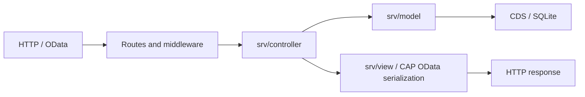

# MVC architecture

The project separates Model, View, and Controller in both the OpenUI5 interface and the local CAP backend. Routes, the CDS schema, and the API remain compatible. Connecting to an external Rust backend uses the same client models and controllers.

## Client: XML Views and MVC

The interface uses declarative XML Views and XML Fragments, following the principles in the [architecture discussion](https://chatgpt.com/share/6aa65869-46d8-83eb-b456-0d1de58a40d6). The CAP and Rust server contracts have been preserved.

| Directory | Responsibility |
| --- | --- |
| `app/view/*.view.xml` | Application shell and ten screens: home, resources, bookings, week, team, users, administration, editor, display, and sign-in |
| `app/fragment/*.fragment.xml` | Reusable cards and forms for bookings, administration, area settings, profiles, accounts, passwords, and display links |
| `app/controller/*.controller.js` | XML event handlers, navigation, and binding updates |
| `app/controller/BaseController.js` | Access to application state, the local JSONModel, and shared card actions |
| `app/controller/Dialogs.js` | Asynchronous XML Fragment loading and a separate draft model for each dialog |
| `app/controller/Account.js`, `Admin.js`, `Reservations.js`, `Planning.js`, `FloorEditor.js`, `Display.js` | Authentication, data writing, autosave, and display workflows |
| `app/model/AppModel.js` | Session state, entity data, filters, and loading protected against stale sessions |
| `app/model/PageData.js`, `AdminSchema.js` | Data prepared for bindings and metadata for administration forms |
| `app/model/BookingModel.js`, `WorkWeekModel.js` | Booking and weekly-plan rules |
| `app/service/Api.js` | CAP/Rust HTTP client, CSRF, pagination, and batch; `app/model/Api.js` retains the old import path |
| `app/control/FloorPlan.js`, `app/view/FloorPlanRenderer.js` | Interactive SVG map control: zoom, mouse, keyboard, drawing, and resizing |

XML defines structure, bindings, and handler names. The `shell` model holds application-shell state, `page` holds data for one screen, `dialog` holds a form draft, and `i18n` is the ResourceModel for the selected language. PageData prepares values for display; business rules remain in the models. API requests go through the Api service.

On the first visit to a screen, App.controller creates it asynchronously with `XMLView.create`. Later visits reuse the same instance and update its visibility and JSONModel data. Selecting a resource or refreshing data no longer rebuilds the entire control tree. Switching sessions destroys cached views and clears their models. A revision counter protects against late screen-loading responses. Dialogs are created with `Fragment.load`, receive separate models, and are released on close.

The old programmatic constructors `*View.js`, `Controls.js`, and `ui.js` have been removed. The SVG renderer remains a JavaScript module because interactive geometry belongs in a custom control; the control itself is declared in XML. The autosave queue combines rapid edits without blocking the map and restores the last confirmed geometry after an error.

`test/browser/xml-views.spec.js` checks that screen and control instances survive navigation, bindings update, an XML dialog is localized, and models are released after a profile switch. `test/i18n.test.js` checks every static i18n binding in XML.

## Server



| Directory | Responsibility |
| --- | --- |
| `db/` | CDS schema and initial data |
| `srv/model/BookingModel.js` | Validation of records, relationships, geometry, and bookings; automatic area names |
| `srv/model/AuthModel.js` | Profiles, passwords, initial setup token, and sessions |
| `srv/model/AccessPolicy.js` | Server-side permissions and protection against unsafe role changes |
| `srv/model/AccountModel.js`, `DisplayModel.js` | Account and display operations |
| `srv/model/WebConfig.js` | Application configuration and build information |
| `srv/controller/` | OData actions and HTTP request handling |
| `srv/routes/` | Registration of authentication and interface routes |
| `srv/middleware/` | Session and Origin checks; external-backend proxy |
| `srv/view/` | Configuration JavaScript and authentication responses; cookie handling |
| `srv/booking-service.cds` | Public OData contract; CAP serializes entities |

`BookingController.handle()` serializes writes inside one CAP transaction. Model checks use `cds.tx(req)`, so conflict detection and writes run in the same transaction. Existing tests for ordinary requests and atomic batch groups continue to check this behavior.

CAP discovers `srv/booking-service.js` as the entry point beside the CDS file. The old paths `srv/auth.js`, `authorization.js`, `web.js`, `plan-image.js`, and `area-name.js` export the new modules for compatibility with configuration, scripts, and tests. Add new functionality in the corresponding MVC directories.

`server.js` and `srv/frontend-server.js` assemble the application from routes and middleware. With `BACKEND_URL`, requests are forwarded to an external server; the local CAP database is not started. This repository's `_RUST` directory contains documentation, not the external Rust application's source code.

## Development and verification

```sh
npm test
npm run test:ui
npm run format:check
```

`npm run format` applies the shared style to application and server JavaScript. Prettier is a development dependency only.

`test/mvc-models.test.js` covers model isolation, stale authentication responses, booking preparation, retaining a draft after errors, and MVC dependency boundaries. `test/plan-autosave.test.js` creates a real editor-controller instance. `test/browser/mvc.spec.js` exercises creating, editing, and cancelling a booking through the resource selector.

### Existing browser-test differences

During the previous MVC refactor, seven older scenarios were rerun against the original controllers and reproduced the same failures:

- `app.spec.js`: booking from the map and switching language while selecting a map resource;
- `parking.spec.js`: creating parking, then selecting a space on the map and configuring a booking from the parking plan;
- `space-selection.spec.js`: all three scenarios for selecting and configuring unlinked areas.

Those scenarios expect the map to show resources without a linked area or allow selection of unlinked areas. The current booking interface displays only areas of the correct type that are linked to resources. The XML migration preserves this behavior and the original checks. The seven scenarios were excluded from the XML migration's targeted run; the complete browser suite should not be assumed to pass. `mvc.spec.js` checks booking through the available resource selector, while `xml-views.spec.js` checks area configuration in the editor and additional XML dialogs.

Run browser tests against a fresh test database: some existing editor tests assume the initial area numbering. Reusing a test server whose data has already changed breaks that assumption.

When adding a feature:

1. Put state, rules, and data transformations in the model.
2. Put screens and dialogs in views, and forward actions to controllers.
3. In a controller, connect user actions, model calls, and view updates.
4. On the server, keep validation inside transactions and route registration separate from business rules.
5. Check the changed workflow and CAP/Rust contract compatibility.
